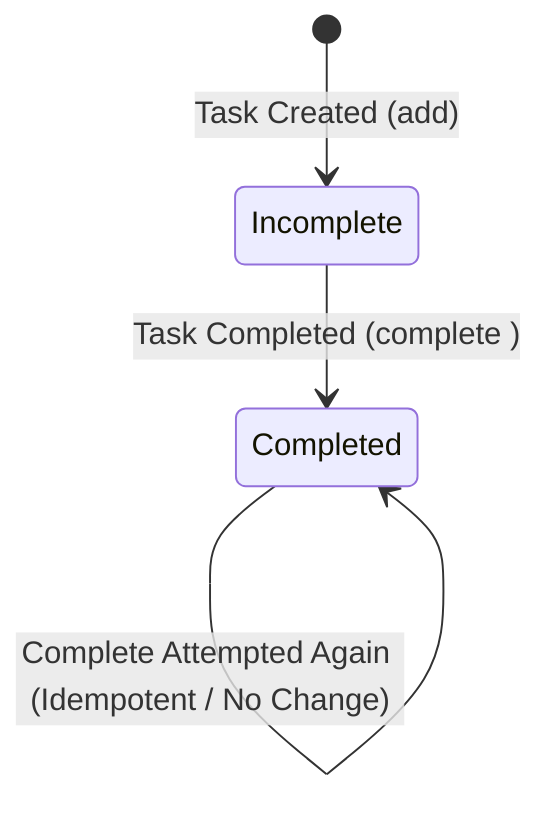

# Data Model: CLI Task Manager & Focus Timer

**Feature**: CLI Task Manager & Focus Timer  
**Spec**: [`specs/001-task-manager-focus-timer/spec.md`](spec.md)  
**Date**: 2026-08-14  

---

## 1. Entities

### 1.1 Task Entity

Represents an individual developer task tracked by the system.

| Field Name | Type | Description | Validation / Constraints |
|------------|------|-------------|---------------------------|
| `ID` | `int` | Unique persistent task identifier. | Must be > 0. Assigned sequentially. |
| `Description` | `string` | Text describing the work item. | Non-empty after trimming whitespace. |
| `Completed` | `bool` | Flag indicating completion status. | `false` when created; transitions to `true`. |
| `CreatedAt` | `time.Time` | ISO 8601 timestamp of task creation. | Set automatically upon task addition. |
| `CompletedAt` | `*time.Time` | ISO 8601 timestamp of task completion. | `nil` until completed; set when marked complete. |

#### State Transitions



---

### 1.2 Task Collection Data Model (JSON Structure)

Represents the full persistent state serialized to the local JSON file.

```json
{
  "version": 1,
  "next_id": 3,
  "tasks": [
    {
      "id": 1,
      "description": "Write unit tests for task manager",
      "completed": true,
      "created_at": "2026-08-14T00:00:00Z",
      "completed_at": "2026-08-14T00:10:00Z"
    },
    {
      "id": 2,
      "description": "Implement focus timer component",
      "completed": false,
      "created_at": "2026-08-14T00:05:00Z",
      "completed_at": null
    }
  ]
}
```

---

### 1.3 Focus Session Entity

Represents an in-memory timed Pomodoro focus session.

| Field Name | Type | Description | Validation / Constraints |
|------------|------|-------------|---------------------------|
| `Duration` | `time.Duration` | Duration of the focus session. | Production default: `25 * time.Minute`. |
| `StartTime` | `time.Time` | Timestamp when session initiated. | Set upon session start. |
| `EndTime` | `time.Time` | Timestamp when session ends. | Calculated as `StartTime + Duration`. |
| `Status` | `string` | Status of focus session. | Values: `"running"`, `"completed"`, `"cancelled"`. |

---

## 2. Business Domain Rules

1. **Task Description Validation**:
   - Empty or whitespace-only descriptions are rejected with domain error `ErrEmptyDescription`.
2. **Task Completion Idempotence**:
   - Marking an already completed task as completed returns domain indicator `ErrTaskAlreadyCompleted` or succeeds idempotently without modifying `CompletedAt` timestamp or corrupting state.
3. **Non-Existent Task Lookup**:
   - Referencing a task ID not present in the collection returns `ErrTaskNotFound`.
4. **JSON File Handling**:
   - Missing JSON file: Treated as an empty task collection (`next_id: 1`, `tasks: []`).
   - Unreadable or corrupted JSON file: Returns `ErrCorruptedStorage` with cause details.
